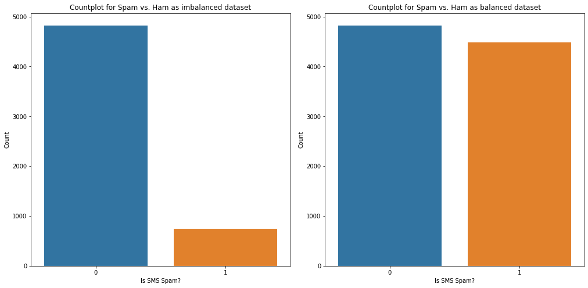
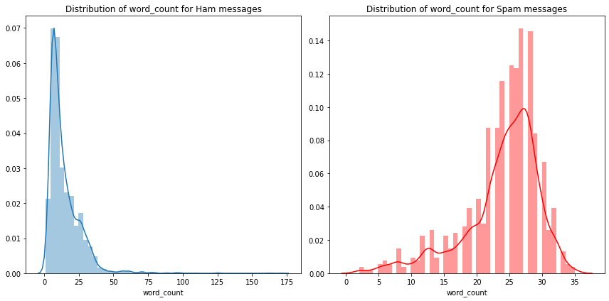
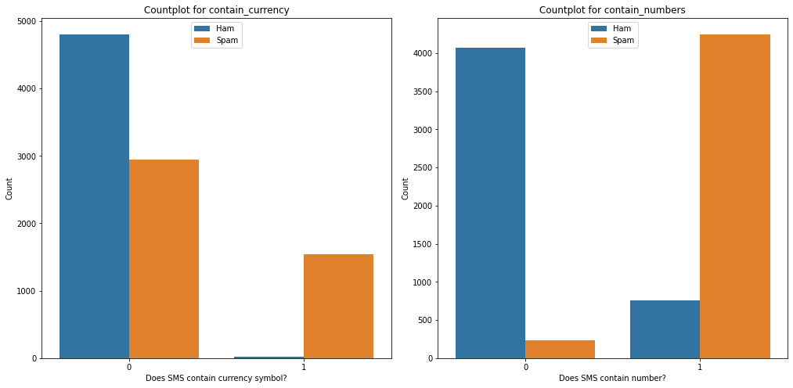
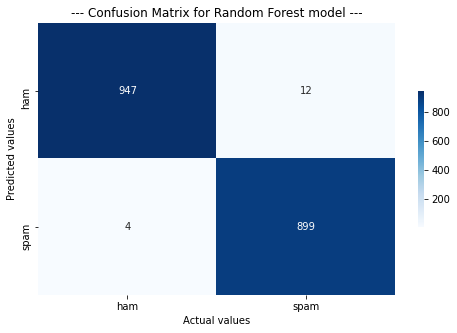

  

## Project Overview
• Created a machine learning model that **detects/classifies a SMS based on the textual data using Natural Language Processing.** 
• **Engineered features like word_count, contains_currency_symbol, and contains_number** from the text SMS.

## How will this project help?
• This project **helps in filtering/cleaning the SMS from the phone.**

## Resources Used
• Packages: **pandas, numpy, sklearn, matplotlib, seaborn, nltk.** 
• Dataset by **UCI Machine Learing on Kaggle**: https://www.kaggle.com/uciml/sms-spam-collection-dataset

## Exploratory Data Analysis (EDA)
• **Exploring NaN values** in dataset
• **Plotted countplot** for SMS labels Spam vs. Ham 

## Feature Engineering
• Handling imbalanced dataset using Oversampling
 
• **Creating new features** from existing features e.g. **word_count, contains_currency_symbol, contains_numbers**, etc. 
 
 

## Data Cleaning
• Removing special character and numbers using regular expression
• Converting the entire sms into lower case
• Tokenizing the sms by words
• Removing the stop words
• Lemmatizing the words
• Joining the lemmatized words
• Building a corpus of messages

## Model Building and Evaluation
**Metric: F1-Score** 
• Multinomial Naive Bayes: 0.943 
• Decision Tree: 0.98 
• **Random Forest: 0.994** 
• Voting (Decision Tree + Multinomial Naive Bayes): 0.98 
_**Note: Evaluation scores are obtained using cross validation.**_ 

## Model Prediction

